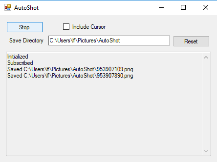

# AutoShot

A small utility to very quickly capture screenshots of the active window
upon clicking it.

I wrote this because I had had enough of psr.exe (Windows Problem Steps
Recorder) saving in compressed proprietary HTML in JPEG. This one saves
in PNG only. It will just dump the files in the folder of your choosing,
no uncompressing MHTML files. This saves a significant amount of labour
since it eliminates needing to crop images or make multiple keystrokes,
click back and forth, etc.

A picture (taken by AutoShot) is worth 1000 words:

Press Start and it will start capturing all clicks and taking a
screenshot for each one. When finished, click Stop.
